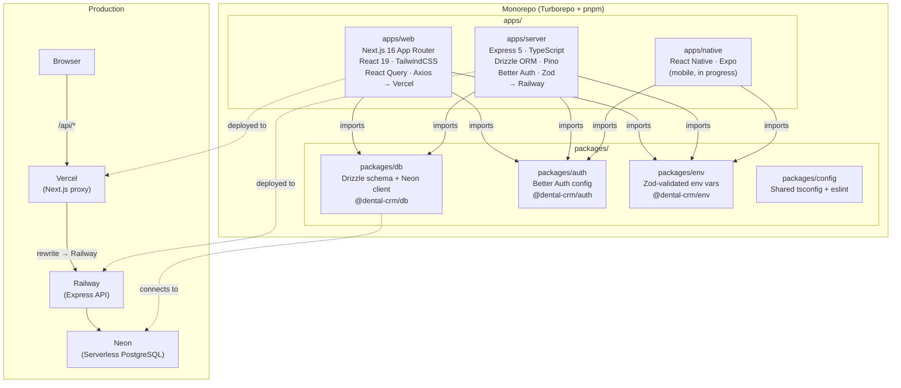
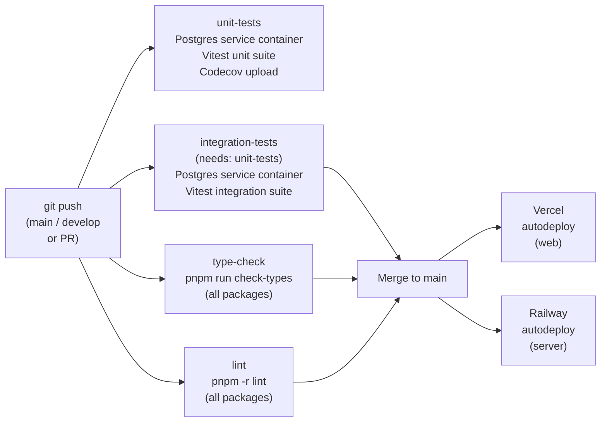

# FlowWise Dental App — Architecture Case Study

>  **This repository contains no source code.** It is an architectural case study of a production application. The full codebase is private.

---

## Table of Contents

1. [Project Overview](#1-project-overview)
2. [Architecture Overview](#2-architecture-overview)
3. [Tech Stack & Why Each Was Chosen](#3-tech-stack--why-each-was-chosen)
4. [Key Technical Decisions](#4-key-technical-decisions)
5. [Security Implementation](#5-security-implementation)
6. [Real-Time Sync](#6-real-time-sync)
7. [CI/CD Pipeline](#7-cicd-pipeline)
8. [What I Would Do Differently](#8-what-i-would-do-differently)
9. [Learnings](#9-learnings)

---

## 1. Project Overview

FlowWise is a **production multi-tenant SaaS application** I built for a improving productivity of dental clinics in India. It replaces a paper-based workflow with a fully digital system covering patient registration (with auto-generated OPD numbers), appointment scheduling, treatment planning with a visual tooth chart, billing with partial payment tracking, and lab work coordination. The system is role-gated — clinic admins, doctors, and receptionists each see a different surface of the application — and enforces complete data isolation between clinics so no tenant's records can ever seen/exposed into another's.

---

## 2. Architecture Overview

The project is structured as a Turborepo monorepo with two deployable applications and three shared packages.



### Request Flow (Production)

All browser traffic goes through Next.js rewrites on Vercel — this keeps cookies first-party, avoiding cross-domain cookie issues between Vercel and Railway:

```
Browser → https://flow-wise-alpha.vercel.app/api/v1/patients
           ↓  Next.js rewrite (next.config.ts)
          https://dummy-backend-url.up.railway.app/api/v1/patients
           ↓  Express middleware chain
          Neon PostgreSQL (WebSocket pool via @neondatabase/serverless)
```

---

## 3. Tech Stack & Why Each Was Chosen

| Technology | Purpose | Why chosen over alternatives |
|---|---|---|
| **Turborepo** | Monorepo orchestration | I needed shared packages (`db`, `auth`, `env`) consumed by three apps simultaneously. Turborepo's task graph and remote caching made builds fast without reaching for Nx's complexity. A simple single repo with symlinks would have made TypeScript path aliases and shared config a nightmare. |
| **Next.js 16 (App Router)** | Frontend framework | App Router gave me co-located server components for auth-gated route checks without writing API calls. The `loading.tsx` / `error.tsx` convention reduced boilerplate per route. I also needed the built-in rewrite capability to proxy API requests transparently for cookie continuity in production. |
| **Express 5** | REST API backend | The client's requirements were a clean REST API. Express 5's async error propagation (errors in `async` route handlers bubble to `next()` automatically) removed the need for `asyncHandler` wrappers on every route. I didn't need GraphQL's flexibility for a domain this well-defined. |
| **Neon DB (Serverless PostgreSQL)** | Primary database | Neon offers serverless PostgreSQL with WebSocket-based connection pooling via `@neondatabase/serverless`. This eliminates cold-start connection exhaustion on Railway's containerised environment where persistent TCP connection pools would hit Postgres's connection limit quickly. The free tier was also useful for staging. |
| **Drizzle ORM** | Database ORM | Drizzle generates TypeScript types directly from schema definitions — the same `packages/db` schema is the source of truth for both migrations and runtime query types. Prisma's generated client adds a build step and abstraction layer I didn't want; Drizzle stays close to SQL. |
| **Better Auth** | Authentication | Rolling custom JWT would mean managing refresh token rotation, device tracking, and OAuth provider integrations myself. Better Auth handles all of that with a Drizzle adapter that writes directly into my existing schema. It sets HTTP-only session cookies out of the box, which is correct auth practice. |
| **Zod** | Schema validation | Used on every API request body, query string, and environment variable. Zod is my primary defence against injection and invalid data — a schema parse either passes or throws a typed `ZodError` that the error handler maps to a `400` response with a specific field pointer. |
| **Helmet** | HTTP security headers | One-line middleware that sets `X-Content-Type-Options`, `X-Frame-Options`, `Strict-Transport-Security`, and a sane `Content-Security-Policy`. No reason not to use it. |
| **Pino + pino-http** | Structured logging | Pino is the fastest Node.js logger by a significant margin. `pino-http` lets me silence successful fast requests (noise in production) while logging 4xx/5xx errors and slow requests (>500ms). I also use Pino's `redact` option to strip passwords and auth headers from log output automatically. |
| **React Query (TanStack)** | Client-side server state | React Query handles caching, refetching, and loading/error states so I don't write `useEffect` + `useState` fetch loops. Mutations automatically invalidate related query keys, keeping the UI consistent after writes. |
| **shadcn/ui + TailwindCSS 4** | UI components | shadcn gives me accessible, unstyled primitives I can own and customise. Tailwind 4's cascade layer approach removed most of the specificity conflicts I hit with earlier versions. |
| **Vercel** | Frontend hosting | Zero-config Next.js deployment with edge CDN. The rewrite rules in `next.config.ts` are evaluated at the edge, making the API proxy transparent to the browser. |
| **Railway** | Backend hosting | Railway detected the Node.js monorepo correctly and let me specify `apps/server` as the root. Automatic restarts on crash and simple environment variable management made it the right choice over running a Docker container on a VPS for a small-scale production app. |
| **GitHub Actions** | CI/CD | Four parallel jobs on every push: unit tests (against a Postgres service container), integration tests, TypeScript type-check, and lint. Deployment is handled by Vercel/Railway's native GitHub integrations, not Actions, so the pipeline stays focused on quality gates only. |
| **nanoid** | Primary key generation | `nanoid()` generates short, URL-safe, collision-resistant IDs without a database sequence. This lets me generate IDs on the application layer before the insert, which simplifies optimistic updates and batch inserts. |

---

## 4. Key Technical Decisions

### 4.1 Turborepo over a simple monolith or separate repos

I considered three options early on: a single Express + Next.js monolith, separate git repos per app, or a monorepo. The shared authentication configuration (`packages/auth`) is the deciding factor — both the Express server and the Next.js frontend need the same Better Auth instance with the same secret and the same Drizzle adapter. In separate repos, keeping that in sync would require a published private npm package and versioning discipline. In a monorepo with Turborepo, `@dental-crm/auth` is just a workspace package. The same argument applies to the database schema (`packages/db`) and Zod-validated environment variables (`packages/env`). Turborepo's task graph (`build` depends on `^build` recursively) ensures packages are compiled before apps that depend on them.

### 4.2 Serverless PostgreSQL and why it matters on Railway

Railway's deployment model runs my Express server as a container that can scale down to zero. Traditional Postgres connection pooling (opening `pg.Pool` on startup) works fine on long-lived servers but fails fast on serverless or frequently-restarted containers — you hit `max_connections` quickly. I chose Neon specifically because `@neondatabase/serverless` uses the Neon HTTP and WebSocket protocols to pool connections on Neon's infrastructure, not inside my process. My Express server doesn't hold any persistent TCP connections to Postgres; each query goes through Neon's pooler. This means cold starts and container restarts have zero impact on database connection health.

### 4.3 Multi-tenancy at the schema level, not the database level

I chose **row-level isolation** over separate schemas or separate databases per clinic. Every tenant table carries a `clinic_id` foreign key, and the `clinicMiddleware` (which runs after `authMiddleware` on every protected route) resolves the user's clinic from the session and attaches it to `req.clinic`. Every service-layer query is then required to filter by `eq(table.clinicId, req.clinic.id)`. This approach trades some query complexity for operational simplicity — one database, one schema, straightforward migrations. OPD counters (`opd_counters` table with `clinic_id + year + last_number`) are also scoped per clinic, so patient numbering is isolated without any global sequence conflicts.

### 4.4 RBAC enforced at the middleware layer, not the route layer

Rather than scattering role checks inside route handlers, I built composable middleware — `requireAdmin`, `requireDoctor`, `requireStaff` — that are applied at route registration time in the router files. The `requireWriteAccess` middleware checks `req.isReadOnly` (set by `clinicMiddleware` when the clinic is in grace period) and returns a `403` before the handler runs. This means a route like `POST /api/v1/patients` has its access policy expressed declaratively in one line (`router.post('/', authMiddleware, clinicMiddleware, requireStaff, requireWriteAccess, handler)`) rather than buried inside the handler body.

### 4.5 The Next.js proxy pattern for production cookie continuity

The biggest deployment challenge was cookies. Better Auth sets a session cookie on the response from the Express server. In local development, frontend (`:3001`) and backend (`:3000`) are different origins but running on the same machine, so `withCredentials: true` works. In production, Vercel and Railway are completely different domains — the browser won't send a Vercel-domain cookie to a Railway URL. The solution was to configure `next.config.ts` to rewrite all `/api/*` requests to Railway transparently. The browser always talks to the Vercel domain; Next.js forwards the request server-side. The cookie is set and read on the Vercel domain, making it fully first-party. Server-side rendering (Next.js Server Components) is the only exception — SSR bypasses rewrites, so auth-server checks forward the `cookie` header manually from `headers()` to the Railway URL directly (server-to-server, not cross-domain from the browser's perspective).

---

## 5. Security Implementation

### SQL Injection Prevention
Drizzle ORM uses parameterised queries throughout — no string interpolation reaches the database driver. All user input that influences a query goes through Drizzle's builder API (`eq`, `ilike`, `and`, `or`), which always produces prepared statement parameters. Additionally, every query is scoped to `clinicId`, so even a successful bypass could only read that clinic's own data.

### Rate Limiting
I implemented three separate `express-rate-limit` limiters with different scopes, each configurable via environment variables:

| Limiter | Window | Limit (production) | Scope |
|---|---|---|---|
| `globalRateLimiter` | 15 minutes | 2,000 req/IP | All non-API routes |
| `authRateLimiter` | 15 minutes | 30 req/IP | `/api/auth/*` only; **skips successful requests** |
| `apiRateLimiter` | 1 minute | 600 req/IP | All `/api/*` except auth |

The auth limiter uses `skipSuccessfulRequests: true` — it only counts failed login attempts, so legitimate users are never blocked. All limiters return standard `RateLimit-*` headers so clients can back off gracefully.

### Helmet Configuration
Helmet is applied as the first middleware before CORS or any business logic, setting a strict set of HTTP security headers including `X-Content-Type-Options: nosniff`, `X-Frame-Options: DENY`, `Strict-Transport-Security` with `includeSubDomains`, and a restrictive `Content-Security-Policy`. The default Helmet configuration is used as-is — no headers are disabled.

### Input Validation Pipeline (Zod)
Every API endpoint has a Zod schema applied via a `validateBody` / `validateQuery` / `validateParams` middleware helper before the handler runs. A `ZodError` thrown anywhere in the parse is caught by the centralised error handler and mapped to a `400 VALIDATION_ERROR` response with the first failing field's path and message. Validated data is returned as a typed value — the route handler never touches raw `req.body` after validation. Environment variables follow the same pattern: `packages/env` runs Zod `.parse()` at startup and throws if any required variable is missing or malformed.

### Auth Token Strategy
Better Auth handles session management with **HTTP-only, Secure, SameSite=Lax cookies**. There are no JWTs in `localStorage`, no tokens exposed to JavaScript. Sessions expire after 7 days with a rolling 1-day update window. The `authMiddleware` calls `auth.api.getSession()` on every protected request — it validates the session cookie against the `session` table in Postgres and then fetches the full user row (including `role`, `clinicId`, `isActive`) to populate `req.user`. An inactive user is rejected with `403` even if the session cookie is valid.

### HIPAA Audit Trail
All routes that touch PHI (patients, treatments, payments, appointments, lab work) use the `auditLog(resource)` middleware. It fires on `res.on('finish')` — after the response is sent — and logs `userId`, `userName`, `userRole`, `clinicId`, `action` (read/create/update/delete mapped from the HTTP method), `resourceId`, and the full request path via Pino with an `audit: true` marker for easy filtering in log aggregators. Failed requests (4xx/5xx) are skipped from the audit trail as those are already covered by `pino-http` error logging.

### Sensitive Data Redaction
Pino's `redact` option is configured to strip `password`, `passwordHash`, `token`, `Authorization`, `Cookie`, and `Set-Cookie` from all log output automatically.

---

## 6. Real-Time Sync

The system has a near-real-time sync requirement: clinic staff need the appointment queue and payment summaries to refresh without manually reloading the page. After evaluating WebSockets, Postgres `LISTEN/NOTIFY`, and Server-Sent Events, I chose **React Query polling** — and the reasoning is deliberate, not a shortcut.

The required update windows are relaxed: the appointment queue can be 30 seconds stale; payment summaries can be 60 seconds stale. The current architecture has no WebSocket infrastructure and no persistent listener process. Introducing Postgres triggers, a listener worker, and a Socket.io/SSE fanout layer would add three new failure points, stateful connection management, and deployment complexity — all for update semantics that a 30-second `refetchInterval` handles identically from a UX standpoint.

**Polling/cache policy matrix:**

| Page / Component | `refetchInterval` | `staleTime` | Background polling |
|---|---|---|---|
| Dashboard queue (`useTodaysQueue`) | 30s | 25s | ❌ paused |
| Appointments page (`useAppointments`) | 30s | 25s | ❌ paused |
| Payments page (`usePayments`) | 60s | 55s | ❌ paused |
| Treatments — pending approvals | 60s | 55s | ❌ paused |
| Patient profile bundle | none (cache-only) | 60s | ❌ paused |

Polling is paused when the tab is in the background (`refetchIntervalInBackground: false`) and resumed on window focus (`refetchOnWindowFocus: true`). After any mutation (check-in, payment creation, approval), the relevant query keys are immediately invalidated via `queryClient.invalidateQueries()`, so the UI reflects the change without waiting for the next poll cycle.

No backend changes were required. No new infrastructure. This is implemented entirely in `apps/web/src/hooks/use-api.ts`.

---

## 7. CI/CD Pipeline

Every push and pull request to `main` or `develop` triggers the GitHub Actions workflow (`test.yml`). Deployment to Vercel and Railway is handled by their native GitHub integrations — the CI pipeline is quality-only.



**Unit tests** spin up a real Postgres 15 container (not mocks), run `db:push` to apply the schema, then run the Vitest suite. Integration tests depend on unit tests passing first (`needs: unit-tests`). Type-check and lint run in parallel with unit tests to keep the total wall-clock time short. Coverage is uploaded to Codecov after unit tests.

Vercel and Railway both watch the `main` branch. Vercel builds `apps/web` and deploys to the edge. Railway rebuilds the `apps/server` container and restarts. Rollbacks are instant on Vercel (promote a previous deployment) and one-click on Railway (redeploy a previous build).

---

## 8. What I Would Do Differently

**1. Start with an integration test suite from day one.**
I added tests later in the project lifecycle, which meant writing tests against already-written code instead of letting test scenarios guide the API contract. The integration test suite I ended up with is solid, but it would have caught several edge cases in the subscription enforcement and RBAC middleware much earlier if it had existed from the first route.

**2. Use Postgres row-level security (RLS) as a second enforcement layer.**
My current multi-tenancy relies entirely on the application layer — `clinicMiddleware` sets `req.clinic` and every query filters by it. This is correct, but a single missed `clinicId` filter in a service function would be a cross-tenant data leak with no database-level backstop. Postgres RLS policies would enforce isolation at the storage layer, meaning the database itself would reject any query without the correct tenant context even if the application layer made a mistake.

**3. Model money as a dedicated value object, not bare integers.**
Storing amounts as integers (whole rupees) avoids floating-point precision bugs, which was the right call. But having raw integers flow through the codebase means the UI layer has to know the convention everywhere it formats currency. A small `Money` wrapper type (value + currency) would have made the intent explicit and let me centralise formatting, conversion, and validation in one place.

---

## 9. Learnings

- **Cookie-based auth across different deployment domains is a real problem**, not a theoretical one. I spent meaningful time debugging the Vercel→Railway cookie flow before landing on the Next.js rewrite proxy pattern. Understanding the browser's same-site and domain scoping rules at a deep level was the only way to reason about the fix correctly.

- **Monorepos require upfront discipline on shared packages.** The `packages/env` Zod-validated environment variable package was one of the best decisions I made — type errors from a missing env var appear at compile time, not at 3 AM in production. But it only works because I set it up as a proper workspace package with its own `tsconfig.json` from the start.

- **Turborepo's task graph is genuinely useful, but only if you configure it correctly.** Early on I had circular task dependencies that caused builds to hang silently. Learning to read `turbo run build --graph` and trace the dependency order was time well spent.

- **Grace-period read-only mode is harder to implement cleanly than it sounds.** Every write endpoint needs to check subscription status. Centralising this in `requireWriteAccess` middleware that reads `req.isReadOnly` (set by `clinicMiddleware`) meant I only had to get the logic right once — but I had to retrofit it to routes that were already written, which was tedious. This should have been in the middleware from the first route.

- **Building for a real client changes how you think about error messages.** A receptionist at a dental clinic seeing `Error: Foreign key constraint violation` is a failure of the whole system. Writing human-readable, actionable error messages for every `4xx` code — "Your subscription is in grace period. Please renew to perform write operations." — is unglamorous work that matters enormously in practice.

---

